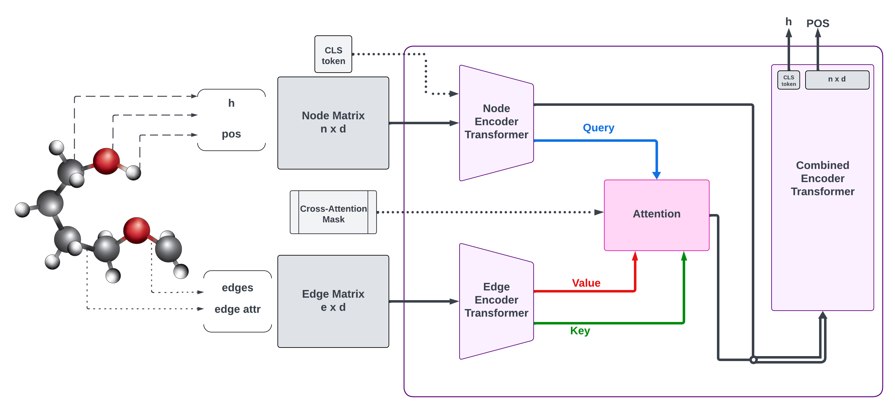

# **DEMETAr: Double Encoder Method for an Equivariant Transformer Architecture"**

### _I. Simion, S. Vasilev, J. Schäfer, G. Go, T. P. Kersten_

---

This blogpost serves as an introduction to our novel implementation of equivariance for transformer architectures. While equivariant transformers do already exist, we propose a method that utilizes two encoders for the node and edge information separately, which we implement in JAX. This allows for more flexibility in the inputs we provide.

This blogpost serves three purposes: 
1. Explain the ideas of equivariance in transformer networks while also explaining some of the methods used.
2. Provide an overview of some reproduction results for other methods (i.e., the Equivariant Graph Neural Network).
3. Give an overview of our method and a comparison with the aforementioned reproduction results.

---

## **Equivariance in Neural Networks**

As equivariance is prevalent in the natural sciences \[1, 2, 3, 11, 17\], it makes sense to utilize them for our neural networks, especially given the evidence suggesting that it significantly improves performance through increasing the network's generalizability \[8\]. One large area within this subfield of deep learning is learning 3D translation and rotation symmetries, where various techniques have been created such as Graph Convolutional Neural Networks \[9\] and Tensor Field Networks \[10\].

Following these works, more efficient implementations have emerged, with the first being the Equivariant Graph Neural Network (EGNN) \[5\]. Based on the GNN \[4, 15, 16\], which follows a message passing scheme, it innovates by inputting the relative squared distance between two coordinates into the edge operation. This specific method bypasses any expensive computations/approximations relative to other, similar methods while retaining high performance levels, making it preferable compared to most other GNN architectures.

More recently, though, transformer architectures have been utilized within the field of equivariant models. While not typically used for these types of problems due to how they were originally developed for sequential tasks \[20, 21\], recent work has suggested their effectiveness to such issues \[7, 18, 19\]. This is possible through the incorporation of domain-related inductive biases, allowing them to model geometric constraints and operations. In addition, one property of transformers is that they assume full adjacency by default, which is something that can be adjusted to better match the local connectivity of GNN approaches.

Here we expand upon this idea by introducing a dual encoder architecture, where unlike most other approaches, the node and edge information are encoded separately. This provides a novel benefit in the form of ...

## **<a name="recap">Recap of Equivariance</a>**

Given a set of $T_g$ transformations on a set $X$ ($T_g: X \rightarrow X$) for an element $g \in G$, where $G$ is a group acting on $X$, a function $\varphi: X \rightarrow Y$ is equivariant to $g$ iff an equivalent transformation $S_g: Y \rightarrow Y$ exists on its output space $Y$, such that:

$$\begin{align} 
\varphi(T_g(x)) = S_g(\varphi(x)). & \qquad \qquad \text{(Equation 1)}
\end{align}$$

In other words, translating the input set $T_g(x)$ and then applying $\varphi(T_x(x))$ on it yields the same result as first running the function $y = \varphi(x)$ and then applying an equivalent translation to the output $S_g(y)$ such that Equation 1 is fulfilled and $\varphi(x+g) = \varphi(x) + g$ \[5\].

<!-- <table align="center">
  <tr align="center">
      <td></td>
  </tr>
  <tr align="left">
    <td colspan=2><b>Figure 1.</b> The Markov process of diffusing noise and denoising [5].</td>
  </tr>
</table> -->

## **<a name="gnns">Equivariant Graph Neural Networks</a>**

For a given graph $\mathcal{G} = (\mathcal{V}, \mathcal{E})$ with nodes $v_i \in \mathcal{V}$ and edges
$=e_{ij} \in \mathcal{E}$, we can define a graph convolutional layer as the following:

$$\begin{align} 
\mathbf{m}\_{ij} = \varphi_e (\mathbf{h}\_i^l, \mathbf{h}\_j^l, a_{ij}), & \qquad \qquad \text{(Equation 2)} \\
\mathbf{m}\_{i} = \sum_{j \in \mathcal{N}\_i } \mathbf{m}\_j, & \qquad \qquad \text{(Equation 3)} \\
\mathbf{h}\_i^{l+1} = \varphi_h (\mathbf{h}\_i^l, \mathbf{m}\_i), & \qquad \qquad \text{(Equation 4)}
\end{align}$$

where $\mathbf{h}\_i^l \in \mathbb{R}^{nf}$ nf is the nf-dimensional embedding of node $v_i$ at layer $l$, $a_{ij}$ are the edge attributes, $\mathcal{N}\_i$ is the set of neighbors of node $v_i$, and $\varphi_e$ and $\varphi_h$ are the
edge and node operations respectively, typically approximated by Multilayer Perceptrons (MLPs).

In order to make this implementation equivariant, \[5\] introduced the inputting of the relative squared distances between two points and updating of the node positions at each time step, leading to the following formulae:

$$\begin{align} 
\mathbf{m}\_{ij} = \varphi_e (\mathbf{h}\_i^l, \mathbf{h}\_j^l, ||\mathbf{x}\_i^l - \mathbf{x}\_j^l||^2, a_{ij}), & \qquad \qquad \text{(Equation 5)} \\
x_i^{l+1} = x_i^l + C \sum_{j \neq i} (\mathbf{x}\_i^l - \mathbf{x}\_j^l) (\mathbf{m}\_{ij}) \varphi_x, & \qquad \qquad \text{(Equation 6)} \\
\mathbf{m}\_{i} = \sum_{j \in \mathcal{N}\_i } \mathbf{m}\_j, & \qquad \qquad \text{(Equation 7)} \\
\mathbf{h}\_i^{l+1} = \varphi_h (\mathbf{h}\_i^l, \mathbf{m}\_i), & \qquad \qquad \text{(Equation 8)}
\end{align}$$

This idea of using the distances during computation forms one of the bases of our proposed transformer architecture, as it is a simple yet effective way to impose geometric equivariance within a system.

## **<a name="architecture">Equivariant Transformers</a>**

<table align="center">
  <tr align="center">
      <td></td>
  </tr>
  <tr align="left">
    <td colspan=2><b>Figure 1.</b> Visualization of the DEMETAr architecture.</td>
  </tr>
</table>

Our method of improving the aforementioned architecture would be to leverage the capabilites of transformers \[6\]. The key difference between these and GNNs is that the former treats the entire input as a fully-connected graph. This would typically make transformers less-suited, though many papers have been published which demonstrate their effectivity in handling these tasks \[7\]. 

As our contribution to the field, we introduce a dual encoder system (visualized in Figure 1). The first one contains all the node features and normalized distances to the molecule's center of mass, while the other exclusively encodes the edge features (i.e., bond type) and an edge length feature. 

To explain this approach, we first need to define the following components:

$$\begin{align} 
& K^l_e, V^l_e &: \text{the keys, values of edge features at layer } l. \\
& K^l_n, V^l_n, Q^l_n &: \text{the keys, values of node features at layer } l.
\end{align}$$

Now we can begin with the actual approach. We first use an edge encoder with $p$ transformer layers on the data to transform the edge features into the node space. Then, we obtain $K^p_e$, $V^p_e$ and perform the following attention operation:

$$\begin{align} 
Z^p_e = \frac{softmax(Q^p_e K^{pT}_n + M) V^p_n}{\sqrt{d}}, \qquad \qquad \text{(Equation 9)}
\end{align}$$

where the output $Z^p_e$ is a matrix of size $n \times d$ (due to the cross-attention) which contains edge encoded information in the node space for every node and $M$ is an adjacency matrix mask of size $n \times e$ where all connections are 0's and non-connections are $-\infty$ to prohibit the attention from attending to non-connected edges. Furthermore, for all layers $< p$, only the edge queries, keys, and values are used, thus no mask is required here. Meanwhile, in the $p$-th layer, we limit the attention to only the connected nodes to calculate the edge features for every node in order to use the node keys. Lastly, the final division after softmaxing by the dimension size $\sqrt(d)$ is to normalize the output scale, a method employed by most other transfomer architectures.

Now, we need to obtain the node encodings, which is done through the following: 

$$\begin{align} 
Z^r_n = \frac{softmax(Q^r_n K^{rT}_n) V^n_r}{\sqrt{d}}, \qquad \qquad \text{(Equation 10)}
\end{align}$$

where $Z^r_n$ is the output of layer $r$, which is the encoder's last layer. Also, similar to the previous formula, we also control the output magnitude by dividing by $\sqrt{d}$.

As we now have both the node and edge features encoded, we can simply sum these encodings to combine them together:

$$\begin{align} 
Z^0_j &= Z^p_e + Z^r_n, \qquad \qquad \text{(Equation 11)}
\end{align}$$

where $Z^0_j$ is the input for a join encoder $Z^j$. This operation can alternatively be interpreted as a residual connection in the node space, where $Z^r_n$ is the residual connection. Afterwards, we continue the computation with an $h$-layer joint encoder and get the output $Z^h_j$. One final note is that we have a [CLS] token which is used for classification in the $Z^0_j$ or the $Z^0_n$ input.

Our dual encoder system is equivariant is through encoding normalized distances to the molecule's center of mass and edge lengths, ensuring that the features are invariant to translations and rotations of the molecule. In addition, the attention mechanism in our transformers uses adjacency masking to ensure that attention is only paid to connected nodes and edges, which inherently respects the graph structure and maintains the relative positional information between nodes and edges. Finally, as a unique benefit of this approach, we allow for flexibility in regards to the way we accept and process inputs, due to being able to focus either only on the nodes or also the edges.

## **<a name="architecture">Evaluating the Models</a>**

As a baseline, we compare our dual encoder transformer to varying architectures, with the first being from \[5\] as it is generally the best performing model. In addition, we also show the baseline performance reported in QM9 to show how our transformer fares with other transformer methods, specifically compared with that of \[7\] as it outperforms many other implementations in the benchmarks tasks (i.e., QM9) due to utilizing radial basis functions to expand the interatomic distances and adjusting the transformer operations to acommodate to these modified distances naturally.

For all the aforementioned methods except TorchMD-Net (due to time constraints), we evaluate and reproduce their performance on the QM9 \[12, 13\] and N-body \[14\] datasets. The former is a task which involves predicting quantum chemical properties (at DFT level) of small organic molecules and is used to evaluate the model performances on invariant tasks due to only requiring property predictions. Meanwhile, the latter is to test how well each model can handle equivariance in the data, as it involves predicting the positions of particles depending on the charges and velocities.

## **<a name="reproduction">Reproduction of the Experiments</a>**

From reproducing the experiments, we obtain the following results:

## **<a name="comparison">Comparison with other Methods</a>**

Meanwhile, when comparing with other implementations, we see below that our method ... . 

<table align="center">
  <tr align="center">
      <th align="left">Metric</th>
      <th align="left">WaveScatt</th>
      <th align="left">NMP</th>
      <th align="left">SchNet</th>
      <th align="left">Cormorant</th>
      <th align="left">LieConv(T3)</th>
      <th align="left">TFN</th>
      <th align="left">SE(3)-Transformer</th>
  </tr>
  <tr align="center">
    <td align="left">εHOMO (meV)</td>
    <td align="left">85</td>
    <td align="left">43</td>
    <td align="left">41</td>
    <td align="left">34</td>
    <td align="left">30</td>
    <td align="left">40</td>
    <td align="left">35.0±.9</td>
  </tr>
  <tr align="left">
    <td colspan=8><b>Table 2.</b> Comparison of results for QM9.</td>
  </tr>
</table>

<table align="center">
  <tr align="center">
      <th align="left"></th>
      <th align="left">Linear</th>
      <th align="left">DeepSet</th>
      <th align="left">Tensor Field</th>
      <th align="left">Set Transformer</th>
      <th align="left">SE(3)-Transformer</th>
  </tr>
  <tr align="center">
    <td align="left">Position</td>
    <td align="left"></td>
    <td align="left"></td>
    <td align="left"></td>
    <td align="left"></td>
    <td align="left"></td>
  </tr>
  <tr align="center">
    <td align="left">MSEx</td>
    <td align="left">0.0691</td>
    <td align="left">0.0639</td>
    <td align="left">0.0151</td>
    <td align="left">0.0139</td>
    <td align="left"><b>0.0076</b></td>
  </tr>
  <tr align="center">
    <td align="left">std</td>
    <td align="left">-</td>
    <td align="left">0.0086</td>
    <td align="left">0.0011</td>
    <td align="left">0.0004</td>
    <td align="left">0.0002</td>
  </tr>
  <tr align="center">
    <td align="left">ΔEQ</td>
    <td align="left">-</td>
    <td align="left">0.038</td>
    <td align="left">1.9 · 10-7</td>
    <td align="left">0.167</td>
    <td align="left">3.2 · 10-7</td>
  </tr>
  <tr align="center">
    <td align="left">Velocity</td>
    <td align="left"></td>
    <td align="left"></td>
    <td align="left"></td>
    <td align="left"></td>
    <td align="left"></td>
  </tr>
  <tr align="center">
    <td align="left">MSEv</td>
    <td align="left">0.261</td>
    <td align="left">0.246</td>
    <td align="left">0.125</td>
    <td align="left">0.101</td>
    <td align="left"><b>0.075</b></td>
  </tr>
  <tr align="center">
    <td align="left">std</td>
    <td align="left">-</td>
    <td align="left">0.017</td>
    <td align="left">0.002</td>
    <td align="left">0.004</td>
    <td align="left">0.001</td>
  </tr>
  <tr align="center">
    <td align="left">ΔEQ</td>
    <td align="left">-</td>
    <td align="left">1.11</td>
    <td align="left">5.0 · 10-7</td>
    <td align="left">0.37</td>
    <td align="left">6.3 · 10-7</td>
  </tr>
  <tr align="left">
    <td colspan=8><b>Table 3.</b> Comparison of results for the N-body task.</td>
  </tr>
</table>

## **<a name="speed">Comparison of Speed</a>**

As our method is implemented using JAX, one advantage is that it is provably faster than the standard PyTorch library. This can be seen in the following graph:

...

Furthermore, having the implementation be fully in JAX allows it to benefit from JIT, for example in terms of helping improve the numerical stability and optimize it for even faster runtimes.

## **Concluding Remarks**

Based on the above, it can be concluded that our method is comparable to other methods that have already been developed in the field.

## **Authors' Contributions**

- Ioana: [fill in your contribution]
- Stefan: [fill in your contribution]
- Jonas: [fill in your contribution]
- Gregory: Code documentation, dependency setup, assisting with comparing implementations and searching for ideas, writing.
- Thies: [fill in your contribution]

## Bibliography

[1] Balaban, A. T. (1985). Applications of graph theory in chemistry. In Journal of Chemical Information and Computer Sciences, 25(3), pp. 334–343. American Chemical Society (ACS). https://doi.org/10.1021/ci00047a033 

[2] Gupta, P., Goel, A., Lin, J.J., Sharma, A., Wang, D., & Zadeh, R.B. (2013). WTF: the who to follow service at Twitter. Proceedings of the 22nd international conference on World Wide Web.

[3] Miller, G. A. (1995). WordNet. In Communications of the ACM (Vol. 38, Issue 11, pp. 39–41). Association for Computing Machinery (ACM). https://doi.org/10.1145/219717.219748 

[4] Gori, M., Monfardini, G., & Scarselli, F. (2005). A new model for learning in graph domains. Proceedings. 2005 IEEE International Joint Conference on Neural Networks, 2(2), 729-734.

[5] Satorras, V. G., Hoogeboom, E., & Welling, M. (2021). E(n) Equivariant Graph Neural Networks. In Proceedings of the 38th International Conference on Machine Learning, 139. https://doi.org/10.48550/ARXIV.2102.09844

[6] Vaswani, A., Shazeer, N., Parmar, N., Uszkoreit, J., Jones, L., Gomez, A. N., … Polosukhin, I. (2017). Attention is All you Need. In I. Guyon, U. V. Luxburg, S. Bengio, H. Wallach, R. Fergus, S. Vishwanathan, & R. Garnett (Eds.), Advances in Neural Information Processing Systems, 30.

[7] Thölke, P., & De Fabritiis, G. (2022). Equivariant Transformers for Neural Network based Molecular Potentials. In International Conference on Learning Representations.

[8] Bronstein, M.M., Bruna, J., Cohen, T., & Veličković, P. (2021). Geometric Deep Learning: Grids, Groups, Graphs, Geodesics, and Gauges. ArXiv, abs/2104.13478.

[9] Cohen, T. & Welling, M. (2016). Group Equivariant Convolutional Networks. Proceedings of The 33rd International Conference on Machine Learning. https://proceedings.mlr.press/v48/cohenc16.html.

[10] Thomas, N., Smidt, T.E., Kearnes, S.M., Yang, L., Li, L., Kohlhoff, K., & Riley, P.F. (2018). Tensor Field Networks: Rotation- and Translation-Equivariant Neural Networks for 3D Point Clouds. ArXiv, abs/1802.08219.

[11] Maron, H., Litany, O., Chechik, G. & Fetaya, E. (2020). On Learning Sets of Symmetric Elements. roceedings of the 37th International Conference on Machine Learning. https://proceedings.mlr.press/v119/maron20a.html.

[12] Blum, L. C., & Reymond, J.-L. (2009). 970 million druglike small molecules for virtual screening in the chemical universe database GDB-13. Journal of the American Chemical Society, 131(25), 8732–8733. https://doi.org/10.1021/ja902302h 

[13] Montavon, G., Rupp, M., Gobre, V., Vazquez-Mayagoitia, A., Hansen, K., Tkatchenko, A., Müller, K.-R., & von Lilienfeld, O. A. (2013). Machine learning of molecular electronic properties in chemical compound space. New Journal of Physics, 15(9), 095003. http://stacks.iop.org/1367-2630/15/i=9/a=095003

[14] Kipf, T., Fetaya, E., Wang, K., Welling, M. & Zemel, R. (2018). Neural Relational Inference for Interacting Systems. Proceedings of the 35th International Conference on Machine Learning. https://proceedings.mlr.press/v80/kipf18a.html.

[15] Bruna, J., Zaremba, W., Szlam, A., & Lecun, Y. (2014). Spectral networks and locally connected networks on graphs. In International Conference on Learning Representations (ICLR2014), CBLS.

[16] Kipf, T. N., & Welling, M. (2016). Semi-supervised classification with graph convolutional networks. CoRR, abs/1609.02907. http://arxiv.org/abs/1609.02907

[17] Ramakrishnan, R., Dral, P. O., Rupp, M., & von Lilienfeld, O. A. (2014). Quantum chemistry structures and properties of 134 kilo molecules. In Scientific Data (Vol. 1, Issue 1). Springer Science and Business Media LLC. https://doi.org/10.1038/sdata.2014.22 

[18] Fuchs, F. B., Worrall, D. E., Fischer, V., & Welling, M. (2020). SE(3)-transformers: 3D roto-translation equivariant attention networks. Proceedings of the 34th International Conference on Neural Information Processing Systems.

[19] Liao, Y.-L., & Smidt, T. (2023). EQUIFORMER: Equivariant graph attention transformer for 3D atomistic graphs. Proceedings of the International Conference on Learning Representations (ICLR).

[20] Devlin, J., Chang, M., Lee, K., & Toutanova, K. (2019). BERT: Pre-training of Deep Bidirectional Transformers for Language Understanding. North American Chapter of the Association for Computational Linguistics. 

[21] Baevski, A., Zhou, H., Mohamed, A., & Auli, M. (2020). wav2vec 2.0: A framework for self-supervised learning of speech representations. Proceedings of the 34th International Conference on Neural Information Processing Systems.
