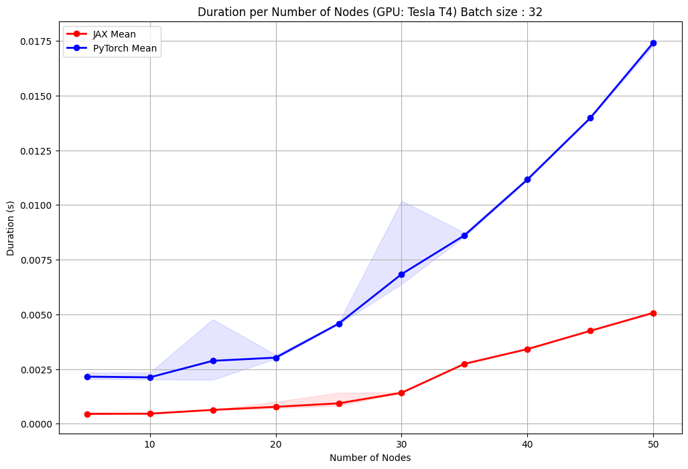
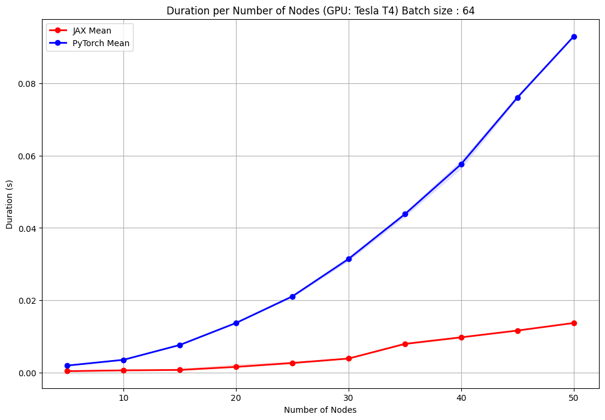
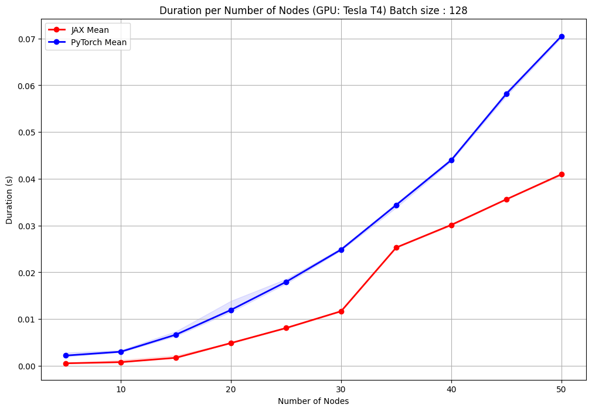
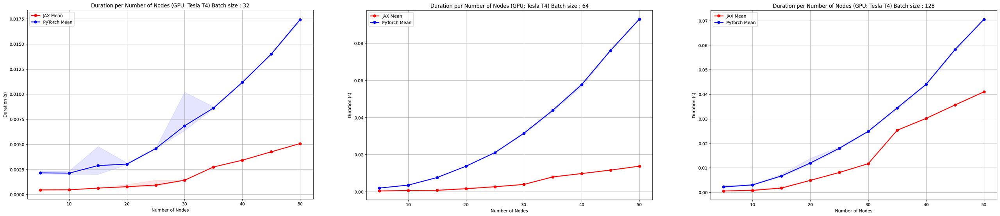

# **Accelerating Equivariant Neural Networks with JAX for Complex Data Sets**

### _I. Simion, S. Vasilev, J. Schäfer, G. Go_

---

This blogpost serves as a tutorial for the fast and scalable training of Equivariant Neural Networks, which are slower to train due to the handling of more complex data. We propose leveraging JAX's capabilities to address these challenges. In this work, we analyze the benefits of utilizing JAX and provide a detailed breakdown of the steps needed to achieve a fully JIT-compatible framework. This approach not only enhances the performance of Neural Networks but also opens the door for future research in developing fully equivariant transformers using JAX.

This blogpost serves three purposes: 
1. Explain the ideas of equivariance in networks while also explaining some of the methods used.
2. Give an overview of the performance tests conducted on the two approaches.
3. Provide an overview of reproduction results for the Equivariant Graph Neural Network.

---

## **Equivariance in Neural Networks**

As equivariance is prevalent in the natural sciences \[1, 2, 3, 11, 17\], it makes sense to utilize them for our neural networks, especially given the evidence suggesting that it significantly improves performance through increasing the network's generalizability \[8\]. One large area within this subfield of deep learning is learning 3D translation and rotation symmetries, where various techniques have been created such as Graph Convolutional Neural Networks \[9\] and Tensor Field Networks \[10\].

Following these works, more efficient implementations have emerged, with the first being the Equivariant Graph Neural Network (EGNN) \[5\]. Based on the GNN \[4, 15, 16\], which follows a message passing scheme, it innovates by inputting the relative squared distance between two coordinates into the edge operation and to make the output equivariant, updates the coordinates of the nodes per layer. This specific method bypasses any expensive computations/approximations relative to other, similar methods while retaining high performance levels, making it preferable compared to most other GNN architectures.

More recently, transformer architectures have been utilized within the field of equivariant models. While not typically used for these types of problems due to how they were originally developed for sequential tasks \[20, 21\], recent work has suggested their effectiveness for tackling such issues \[7, 18, 19\]. This is possible through the incorporation of domain-related inductive biases, allowing them to model geometric constraints and operations. In addition, one property of transformers is that they assume full adjacency by default, which is something that can be adjusted to better match the local connectivity of GNN approaches. These additions further increase the complexity of the framework, strongly highlighting the need for a more efficient alternative.

## **<a name="recap">Recap of Equivariance</a>**

Given a set of $T_g$ transformations on a set $X$ ($T_g: X \rightarrow X$) for an element $g \in G$, where $G$ is a group acting on $X$, a function $\varphi: X \rightarrow Y$ is equivariant to $g$ iff an equivalent transformation $S_g: Y \rightarrow Y$ exists on its output space $Y$, such that:

$$\begin{align} 
\varphi(T_g(x)) = S_g(\varphi(x)). & \qquad \qquad \text{(Equation 1)}
\end{align}$$

In other words, translating the input set $T_g(x)$ and then applying $\varphi(T_x(x))$ on it yields the same result as first running the function $y = \varphi(x)$ and then applying an equivalent translation to the output $S_g(y)$ such that Equation 1 is fulfilled and $\varphi(x+g) = \varphi(x) + g$ \[5\].

## **<a name="gnns">Equivariant Graph Neural Networks</a>**

For a given graph $\mathcal{G} = (\mathcal{V}, \mathcal{E})$ with nodes $v_i \in \mathcal{V}$ and edges
$=e_{ij} \in \mathcal{E}$, we can define a graph convolutional layer as the following:

$$\begin{align} 
\mathbf{m}\_{ij} = \varphi_e (\mathbf{h}\_i^l, \mathbf{h}\_j^l, a_{ij}), & \qquad \qquad \text{(Equation 2)} \\
\mathbf{m}\_{i} = \sum_{j \in \mathcal{N}\_i } \mathbf{m}\_j, & \qquad \qquad \text{(Equation 3)} \\
\mathbf{h}\_i^{l+1} = \varphi_h (\mathbf{h}\_i^l, \mathbf{m}\_i), & \qquad \qquad \text{(Equation 4)}
\end{align}$$

where $\mathbf{h}\_i^l \in \mathbb{R}^{nf}$ is the nf-dimensional embedding of node $v_i$ at layer $l$, $a_{ij}$ are the edge attributes, $\mathcal{N}\_i$ is the set of neighbors of node $v_i$, and $\varphi_e$ and $\varphi_h$ are the
edge and node operations respectively, typically approximated by Multilayer Perceptrons (MLPs).

In order to make this implementation equivariant, \[5\] introduced the inputting of the relative squared distances between two points and updating of the node positions at each time step, leading to the following formulae:

$$\begin{align} 
\mathbf{m}\_{ij} = \varphi_e (\mathbf{h}\_i^l, \mathbf{h}\_j^l, ||\mathbf{x}\_i^l - \mathbf{x}\_j^l||^2, a_{ij}), & \qquad \qquad \text{(Equation 5)} \\
x_i^{l+1} = x_i^l + C \sum_{j \neq i} (\mathbf{x}\_i^l - \mathbf{x}\_j^l) \varphi_x(\mathbf{m}\_{ij}) , & \qquad \qquad \text{(Equation 6)} \\
\mathbf{m}\_{i} = \sum_{j \in \mathcal{N}\_i } \mathbf{m}\_j, & \qquad \qquad \text{(Equation 7)} \\
\mathbf{h}\_i^{l+1} = \varphi_h (\mathbf{h}\_i^l, \mathbf{m}\_i). & \qquad \qquad \text{(Equation 8)}
\end{align}$$

This idea of using the distances during computation forms an important basis in these architectures, as it is a simple yet effective way to impose geometric equivariance within a system.

### Why JAX?

JAX is a high-performance numerical computing library that provides several advantages over traditional frameworks. By default, JAX automatically compiles library calls using just-in-time (JIT) compilation, ensuring optimal execution. It utilizes XLA-optimized kernels, allowing for sophisticated algorithm expression without leaving Python. Furthermore, JAX also excels in utilizing multiple GPU or TPU cores and automatically evaluating gradients through differentiation transformations, making it ideal for high-compute scenarios.

This is partially caused by how JAX often uses pointers to reference elements in memory instead of copying them, which has several advantages:

- **Efficiency:** Through pointers, JAX avoids the unnecessary copying of data, resulting in faster computations and lower memory usage.
- **Functionally Pure:** Since JAX functions are pure (i.e., contain no side effects), using pointers ensures that the data is not accidentally modified, maintaining the integrity of all operations.
- **Automatic Differentiation:** JAX's efficient gradient computation relies on its functional programming model. Pointers allow JAX to track operations and dependencies without data duplication.

---

## **Experiments**

### **N-Body dataset**

In this dataset, a dynamical system consisting of 5 atoms is modeled in 3D space. Each atom has a positive and negative charge, a starting position and a starting velocity. The task is to predict the position of the particles after 1000 time steps. The movement of the particles follow the rules of physics: Same charges repel and different charges attract. The task is equivariant in the sense, that translating and rotating the 5-body system on the input space is the same as rotating the output space.

### **QM9 dataset**

This dataset consists of small molecules and the task is to predict a chemical property. The atoms of the molecules have 3 dimensional positions and each atom is one hot encoded to the atom type. This task is an invariant task, since the chemical property does not depend on position or rotation of the molecule. In addition, larger batch sizes were also experimented with due to smaller sizes causing bottlenecks during training. 

### Data Preparation

Here, we introduce a straightforward method for preprocessing data from a PyTorch-compatible format to one suitable for JAX. Our approach handles node features, edge attributes, indices, positions, and target properties. The key step would be converting the data to jax numpy (jnp) arrays, ensuring compatibility with JAX operations. For usage examples, refer to `qm9\utils.py` or `n_body\utils.py`.

### Training

We now address the key differences and steps in adapting the training loop, model saving, and evalution functions for JAX (refer to `main_qm9.py` and `nbody_egnn_trainer.py`).

JAX uses a functional approach to define and update the model parameters. We use `jax.jit` via the `partial` decorator for JIT compilation, which ensures that our code runs efficiently by compiling the functions once and then executing them multiple times. We also utilize `static_argnames` as decorators for the loss and update functions, which specify the arguments to treat as static. By doing this, JAX can assume these arguments will not change and optimize the function accordingly. 

Moreover, model initialization in JAX requires knowing the input sizes beforehand. We extract features to get their shapes and initialize the model using `model.init(jax_seed, *init_feat, max_num_nodes)`. This seed initializes the random number generators, which then produces the random number sequences used in virtually all processes. Also, this seed is created using the `jax.random.PRNGKey` function, which is used for all random operations. This ensures that they are all reproducible and can be split into multiple independent keys if needed.

The loss function is called through `jax.grad(loss_fn)(params, x, edge_attr, edge_index, pos, node_mask, edge_mask, max_num_nodes, target)`. `jax.grad` is a powerful tool in JAX for automatic differentiation, allowing us to compute gradients of scalar-valued functions with respect to their inputs.

---
## Evaluation
### **<a name="speed">Speed Comparison</a>**

The EGNN authors [5] note that while their approach is more computationally efficient, it is still slower than Linear and Graph Neural Networks. Thus, the aim is to preserve the properties of the model while also providing a fast alternative. We demonstrate the effectivity of building a JAX-based alternative by comparing the forward pass times of the original EGNN implementation with our version. The results of which can be seen in the following graph:

<table align="center">
  <tr align="center">
    <td></td>
    <td></td>
    <td></td>
  </tr>
  <tr align="center">
    <td colspan="3"><b>Figure 2.</b> EGNN speed comparison between JAX EGNN (ours) and the PyTorch EGNN [5]. Benchmark results represent a single forward pass averaged over 100 tries. The batch sizes used here are 32, 64 and 128.</td>
  </tr>
</table>
<!-- <table align="center">
  <tr align="center">
      <td></td>
  </tr>
  <tr align="left">
    <td colspan=2><b>Figure 2.</b> EGNN speed comparison between JAX EGNN (ours) and PyTorch EGNN (model to reproduce [5]). Benchmark results represent a single forward pass averaged over 100 tries. Batch size used here is 32, 64 and 128. We can see great results for the jax implementation across the scale, with less spikes in duration values.</td>
  </tr>
</table> -->

One notable observation is the consistency in performance. The JAX implementation exhibits less variance in duration values, resulting in more stable and predictable performances across runs. This is particularly important for large-scale applications where the performance consistency can impact overall system reliability and efficiency.

Additionally, as the number of nodes increases, the JAX implementation maintains a less steep increase in computation time compared to PyTorch. This indicates better scalability, making the JAX-based EGNN more suitable for handling larger and more complex graphs.

## **<a name="reproduction">Reproduction Results</a>**

To show that our implementation generally preserves the performance and characteristics of the base model, we perform a reproduction of the results reported in [5] and display the results for several properties in both experiments. They can be found in the table below.

<table align="center">
  <tr align="center">
      <th align="left">Task</th>
      <th align="left">EGNN</th>
      <th align="left">EGNN (Ours) </th>
  </tr>
  <tr align="center">
    <td align="left"> QM9 (εHOMO) (meV)</td>
    <td align="left">29</td>
    <td align="left">75</td>
  </tr>
  <tr align="center">
    <td align="left">N-Body (Position MSE)</td>
    <td align="left">0.0071</td>
    <td align="left">0.0025</td>
  </tr>
  <tr align="left">
    <td colspan=6><b>Table 1.</b> Reproduction results comparing [5] with our Jax implementation.</td>
  </tr>
</table>

Here, our EGNN implementation outperforms the original author's implementation on the N-Body dataset. Moreover, other publicly available EGNN implementations also achieve a similar performance as our model on our data. We therefore argue that the increased performance stems from how the dataset is generated slightly differently compared to the one presented in \[5\].

---

## Concluding Remarks

Our EGNN comparisons reveal that the JAX-based model is faster than traditional PyTorch implementations, benefiting from JIT compilation to optimize runtime performance. In addition, we also demonstrate that these JAX-based models also achieve comparable performances to the aforementioned PyTorch ones, meaning that they are generally more suitable for equivariance tasks.

We also adapted the model for two well-known datasets: the QM9 dataset for molecule property prediction and the N-body dataset for simulating physical systems. This demonstrates the flexibility and potential of our JAX framework as a strong foundation for further development. Our work suggests that the JAX-based EGNN framework can be effectively extended to other applications, facilitating future research and advancements in equivariant neural networks and beyond.

---

## Bibliography

[1] Balaban, A. T. (1985). Applications of graph theory in chemistry. In Journal of Chemical Information and Computer Sciences, 25(3), pp. 334–343. American Chemical Society (ACS). https://doi.org/10.1021/ci00047a033 

[2] Gupta, P., Goel, A., Lin, J.J., Sharma, A., Wang, D., & Zadeh, R.B. (2013). WTF: the who to follow service at Twitter. Proceedings of the 22nd international conference on World Wide Web.

[3] Miller, G. A. (1995). WordNet. In Communications of the ACM (Vol. 38, Issue 11, pp. 39–41). Association for Computing Machinery (ACM). https://doi.org/10.1145/219717.219748 

[4] Gori, M., Monfardini, G., & Scarselli, F. (2005). A new model for learning in graph domains. Proceedings. 2005 IEEE International Joint Conference on Neural Networks, 2(2), 729-734.

[5] Satorras, V. G., Hoogeboom, E., & Welling, M. (2021). E(n) Equivariant Graph Neural Networks. In Proceedings of the 38th International Conference on Machine Learning, 139. https://doi.org/10.48550/ARXIV.2102.09844

[6] Vaswani, A., Shazeer, N., Parmar, N., Uszkoreit, J., Jones, L., Gomez, A. N., … Polosukhin, I. (2017). Attention is All you Need. In I. Guyon, U. V. Luxburg, S. Bengio, H. Wallach, R. Fergus, S. Vishwanathan, & R. Garnett (Eds.), Advances in Neural Information Processing Systems, 30.

[7] Thölke, P., & De Fabritiis, G. (2022). Equivariant Transformers for Neural Network based Molecular Potentials. In International Conference on Learning Representations.

[8] Bronstein, M.M., Bruna, J., Cohen, T., & Veličković, P. (2021). Geometric Deep Learning: Grids, Groups, Graphs, Geodesics, and Gauges. ArXiv, abs/2104.13478.

[9] Cohen, T. & Welling, M. (2016). Group Equivariant Convolutional Networks. Proceedings of The 33rd International Conference on Machine Learning. https://proceedings.mlr.press/v48/cohenc16.html.

[10] Thomas, N., Smidt, T.E., Kearnes, S.M., Yang, L., Li, L., Kohlhoff, K., & Riley, P.F. (2018). Tensor Field Networks: Rotation- and Translation-Equivariant Neural Networks for 3D Point Clouds. ArXiv, abs/1802.08219.

[11] Maron, H., Litany, O., Chechik, G. & Fetaya, E. (2020). On Learning Sets of Symmetric Elements. roceedings of the 37th International Conference on Machine Learning. https://proceedings.mlr.press/v119/maron20a.html.

[12] Blum, L. C., & Reymond, J.-L. (2009). 970 million druglike small molecules for virtual screening in the chemical universe database GDB-13. Journal of the American Chemical Society, 131(25), 8732–8733. https://doi.org/10.1021/ja902302h 

[13] Montavon, G., Rupp, M., Gobre, V., Vazquez-Mayagoitia, A., Hansen, K., Tkatchenko, A., Müller, K.-R., & von Lilienfeld, O. A. (2013). Machine learning of molecular electronic properties in chemical compound space. New Journal of Physics, 15(9), 095003. http://stacks.iop.org/1367-2630/15/i=9/a=095003

[14] Kipf, T., Fetaya, E., Wang, K., Welling, M. & Zemel, R. (2018). Neural Relational Inference for Interacting Systems. Proceedings of the 35th International Conference on Machine Learning. https://proceedings.mlr.press/v80/kipf18a.html.

[15] Bruna, J., Zaremba, W., Szlam, A., & Lecun, Y. (2014). Spectral networks and locally connected networks on graphs. In International Conference on Learning Representations (ICLR2014), CBLS.

[16] Kipf, T. N., & Welling, M. (2016). Semi-supervised classification with graph convolutional networks. CoRR, abs/1609.02907. http://arxiv.org/abs/1609.02907

[17] Ramakrishnan, R., Dral, P. O., Rupp, M., & von Lilienfeld, O. A. (2014). Quantum chemistry structures and properties of 134 kilo molecules. In Scientific Data (Vol. 1, Issue 1). Springer Science and Business Media LLC. https://doi.org/10.1038/sdata.2014.22 

[18] Fuchs, F. B., Worrall, D. E., Fischer, V., & Welling, M. (2020). SE(3)-transformers: 3D roto-translation equivariant attention networks. Proceedings of the 34th International Conference on Neural Information Processing Systems.

[19] Liao, Y.-L., & Smidt, T. (2023). EQUIFORMER: Equivariant graph attention transformer for 3D atomistic graphs. Proceedings of the International Conference on Learning Representations (ICLR).

[20] Devlin, J., Chang, M., Lee, K., & Toutanova, K. (2019). BERT: Pre-training of Deep Bidirectional Transformers for Language Understanding. North American Chapter of the Association for Computational Linguistics. 

[21] Baevski, A., Zhou, H., Mohamed, A., & Auli, M. (2020). wav2vec 2.0: A framework for self-supervised learning of speech representations. Proceedings of the 34th International Conference on Neural Information Processing Systems.
